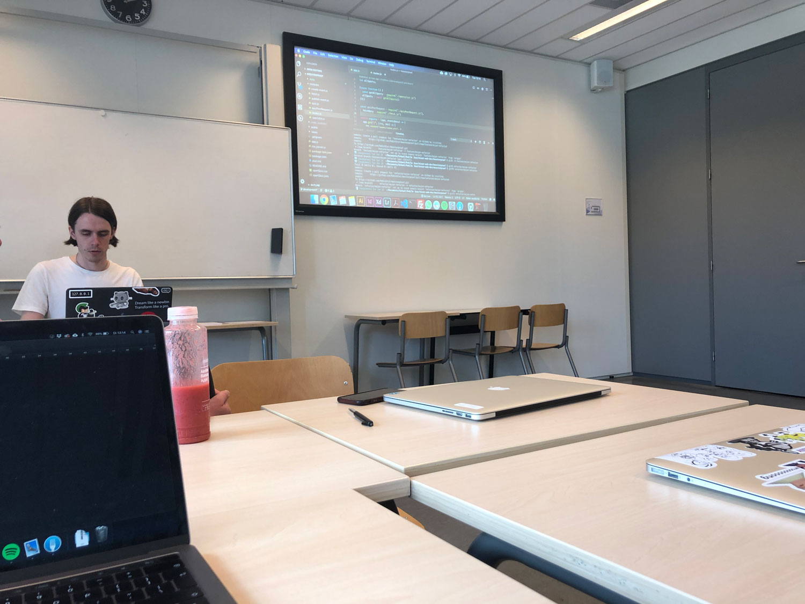
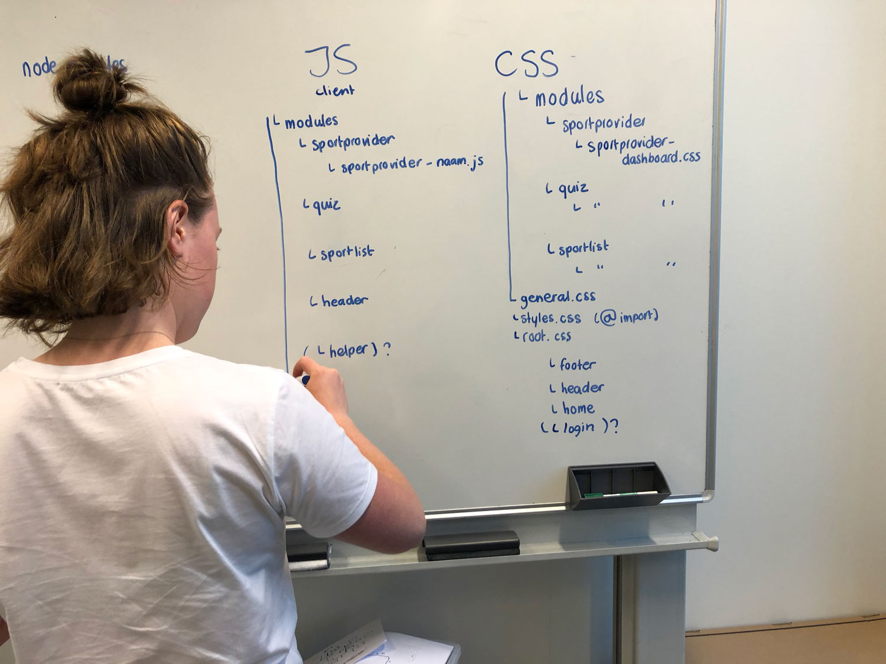

# meesterproef-personal

Tijdens de meesterproef ben ik in samenwerking Sterre, Bas en Jesse bezig om het sportaanbod in Amsterdam Zuid-Oost beter op de kaart te krijgen. Doordat er vele nationaliteiten binnen Zuid-Oost aanwezig zijn en er diverse doelgroepen zich daar bevinden, is het de uitdaging om deze groep zo goed mogelijk aan te spreken. Met zijn vieren maken we een gezamenlijk prototype waar de community informatie kan vinden en een quiz kan volgen om te kijken welke sport er het meest geschikt is voor die persoon. Ook de sport-aanbieder hebben hun eigen omgeving, waar ze evenementen kunnen aanmaken voor hun sportclub.

De rubric bestaat uit de volgende punten:

[WAFS:](https://docs.google.com/spreadsheets/d/e/2PACX-1vTjZGWGPC_RMvTMry8YW5XOM79GEIdgS7I5JlOe6OeeOUdmv7ok1s9jQhzojNE4AsyzgL-jJCbRj1LN/pubhtml?gid=0&single=true)

[CSSTTR:](https://docs.google.com/spreadsheets/d/1Xv48MSiACNmnM6nXpGGUb8mJDC459uSaxJszO_zLEp8/edit#gid=0)

[BT:](https://docs.google.com/spreadsheets/d/1X8XBbblGAcoij4zPcbjZ5FHcQMusn1hc0NvNkzP5qx4/edit#gid=0)

[PM:](https://docs.google.com/spreadsheets/d/e/2PACX-1vTO-pc2UMvpT0pUjt6NJeckc5N9E7QvCxEfVJW1JjuM0m_9MM8ra05J0s6br486Rocz5JVMhAX_C37_/pubhtml?gid=0&single=true)

[WD:](https://docs.google.com/spreadsheets/d/1KpPZXGFWDdw4Y_pcyCYT-OdU2MLnE_i_F0W4rzd7TPg/edit#gid=0)

[RTW:](https://docs.google.com/spreadsheets/d/e/2PACX-1vSd1I4ma8R5mtVMyrbp6PA2qEInWiOialK9Fr2orD3afUBqOyvTg_JaQZ6-P4YGURI-eA7PoHT8TRge/pubhtml)

De vakken waar ik beoordelingscriteria uit heb gehaald zijn WebApp From Scratch (WAFS), Browser Technologies (BT) en Web Design (WD). Ik heb ervoor gekozen om me op WAFS te richten omdat ik hier de meeste verbetering in kan maken. Voor deze minor heb ik amper met javascript gewerkt, en wanneer ik iets in elkaar heb gezet is hier vaak een mooiere techniek voor. Nadat iets werkt, neem ik vaak niet de tijd om te kijken hoe dit beter zou kunnen. De beoordelingspunten die mij geschikt lijken uit het vak WAFS zijn:

```
• De code bevat geen syntax fouten en is netjes opgemaakt

• Er is minimaal gebruik gemaakt van een IIFE en Object Literals om structuur, in de vorm van modules, aan te brengen aan de code en onnodige vervuiling van de globale scope te voorkomen
```

Het vak BT is eigenlijk essentieel voor de beoordeling. De doelgroep in Amsterdam Zuid-Oost is zo divers, dat iedereen op een ander device werkt, waar niet iedereen de nieuwste features zal kunnen gebruiken. Er moet dus rekening gehouden worden dat javascript niet bij iedereen aan staat, en dat bepaalde css toepassingen ook niet door elke browser ge-support worden. De beoordelingscriteria die ik hier bij vind passen is:

```
• Student laat zien hoe Progressive Enhancement toe te passen in Web Development
```

Als laatste heb ik uit het vak WD ervoor gekozen om het testproces te laten beoordelen. We werken voor deze opdrachtgever samen met studenten van de UX, en omdat er een taalbarrière is tussen de doelgroep en de UX studenten, hebben wij de testen nauw gevolgd. Het is voor ons belangrijk dat de interactie met ons prototype en de doelgroep zo goed mogelijk werkt, zodat de opdrachtgever hier het beste resultaat uit kan halen. De beoordelingscriteria die ik hier bij vind passen is:

```
• Er zijn verschillende tests gedaan en verwerkt om het ontwerp te verbeteren.
```

<hr>

Mijn grootste doel momenteel is te leren hoe ik zo slim mogelijk kan refactoren. Momenteel is mijn probleem dat wanneer ik iets werkend krijg, ik er niet meer naar kijk hoe iets slimmer kan. Als ik dit wel zou doen is mijn code veel bruikbaarder en is het ook in andere projecten te gebruiken. Dit geld niet alleen voor de code die ik schrijf, maar ook de gehele structuur van het project. Om die reden heb ik de hulp van mijn projectgroep ingeschakeld en zijn we gezamenlijk gaan zitten hoe we dingen beter kunnen aanpakken.

Als eerst hebben we gekeken naar wat de prioriteiten zijn binnen het project. Hier is de **MoSCoW** techniek voor toegepast. Door deze techniek toe te passen werd het voor ons duidelijk dat we bepaalde belangrijke onderdelen beter kunnen achterlaten. Onder Must hebben we het volgende geplaatst:

- Quiz
- A-Z Sport Activities
- Sport provider login page
- Events

Tijdens het verloop van het project hebben we het concept van de UX studenten iets bijgestuurd, zodat de call to action veel slimmer zou zijn. De drempel voor de doelgroep is namelijk dat de verwachting is dat sport gratis is. Door nu een gratis event te bezoeken om kennis te maken met een specifieke sport op een club, ben je eerder geneigd de stap te zetten.

Bij Should hebben we het volgende beschreven:

- Sport Facilities(map)
- Places to be
- Sport stories

Hiervan worden waarschijnlijk alleen de eerste twee uitgewerkt.


Nadat we de **MoSCoW** gezamenlijk hebben opgesteld, heb ik een leeg lokaal gevonden om hier vervolgens met de groep mijn- en onze code te bespreken. Hier keken we op de beamer door onze code en zijn we gaan bespreken hoe we bepaalde oplossingen anders konden doen zodat er meer gebruikt kon worden. Omdat ik had aangegeven dat dit een groot leerdoel voor mij was, hadden we besloten dat ik hier dan eindverantwoordelijke voor zou zijn.



Tijdens het doorlopen van de code kwamen we ook tot de conclusie dat ook onze mappen structuur een refactor kon gebruiken. De naming van alle files was hier dan ook belangrijk. Het lastige hiervan was dat bepaalde files aan elkaar gelinked waren waardoor routes niet meer werkte. Het uitschrijven van dit proces heeft hierbij enorm geholpen, zodat we gezamenlijk tot de juiste oplossing kwamen.




De data die we gebruiken binnen het project was door al het prototypen niet overzichtelijk meer. De juiste stond niet in bestanden die daar voor bedoeld waren. Ik heb vervolgens gevraagd of we hier gezamenlijk naar kunnen kijken. Het helpt mij enorm om dit samen te doen, omdat ik zelf veel moeite ervaar met het bedenken van de juiste structuur van deze data. Nadat we een conclusie hadden getrokken, heb ik de veranderingen doorgevoerd van deze data.

Refactor commits:

- (https://github.com/RobinStut/meesterproef/commit/2abaadc532a4919805a9f32037ad19cb31028cf0)
- (https://github.com/RobinStut/meesterproef/commit/d09b4a9a202f0c22a134d0e9c5ebaf40485520a7)
- (https://github.com/RobinStut/meesterproef/commit/bc4a29a742435c08298658497548aefa11233609)


