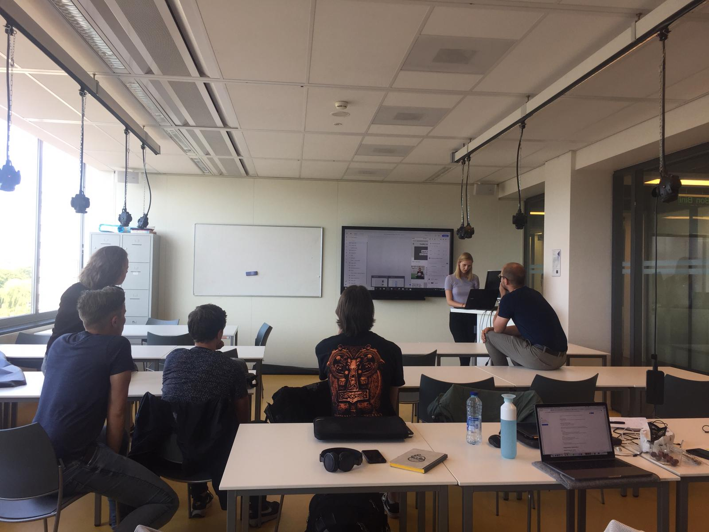
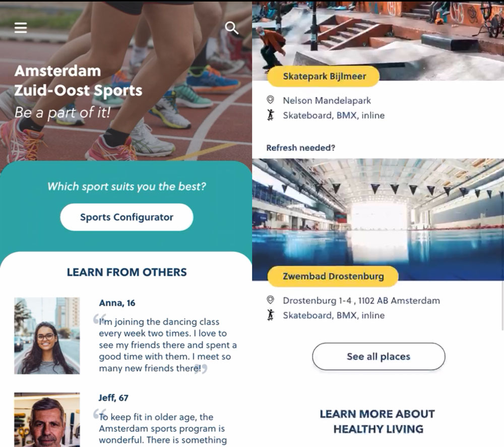
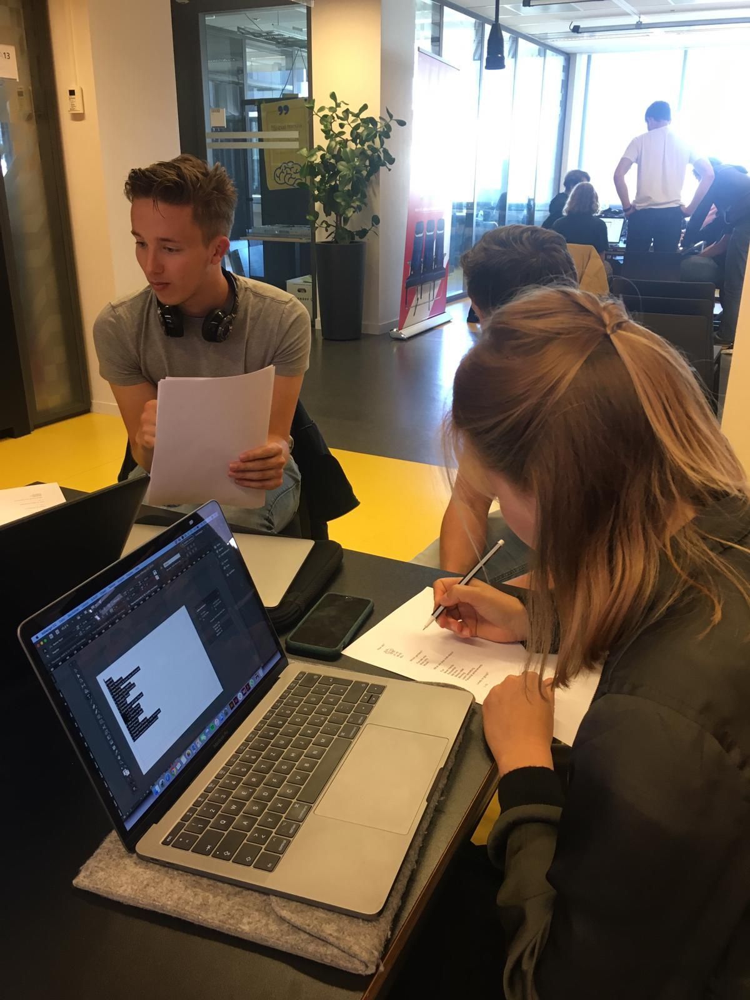
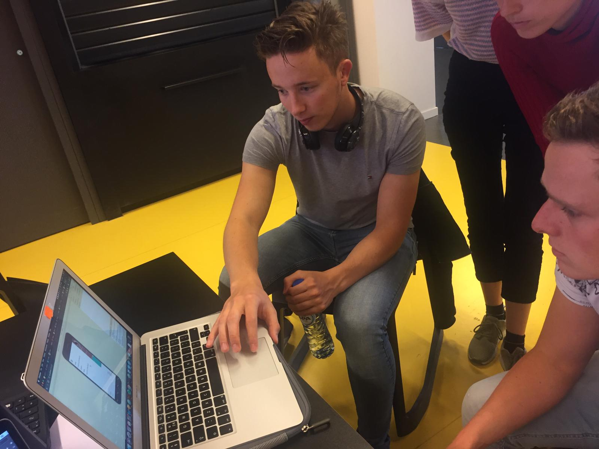
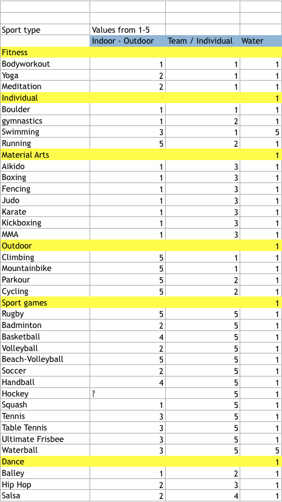
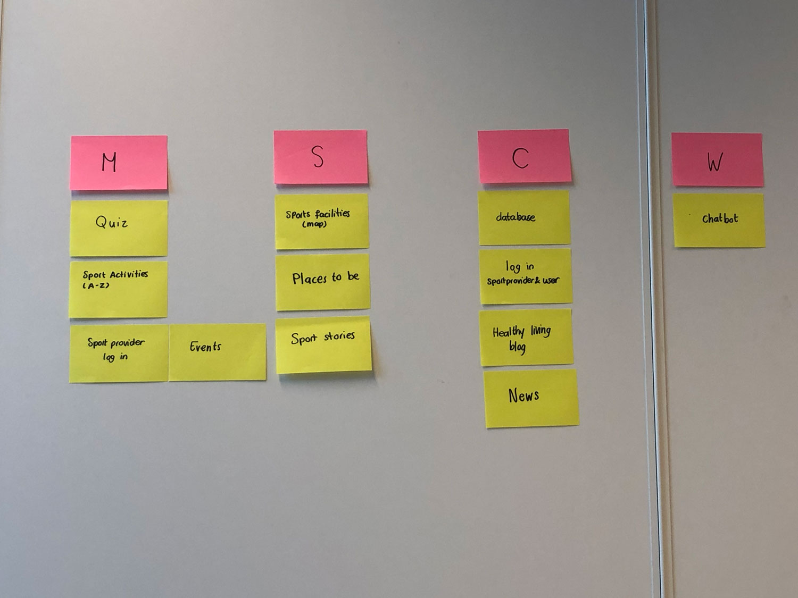
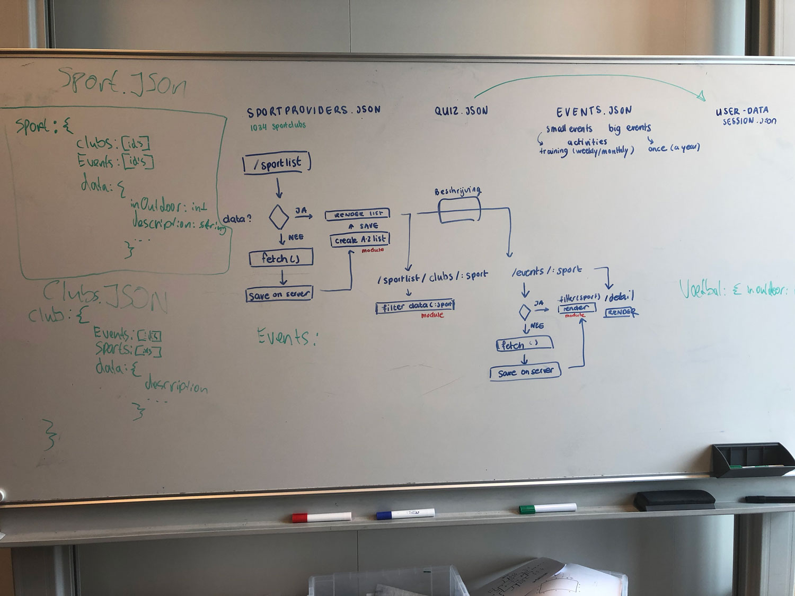
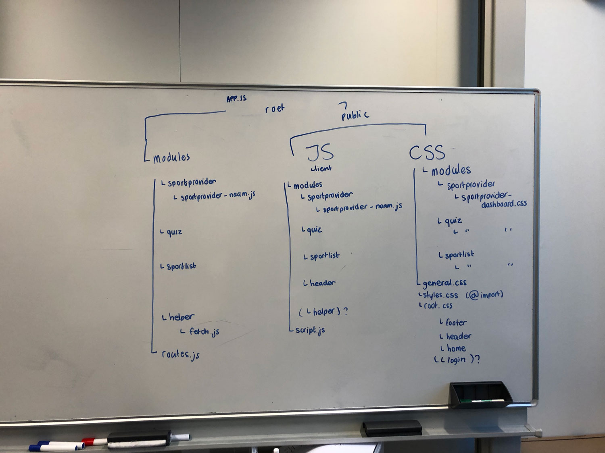
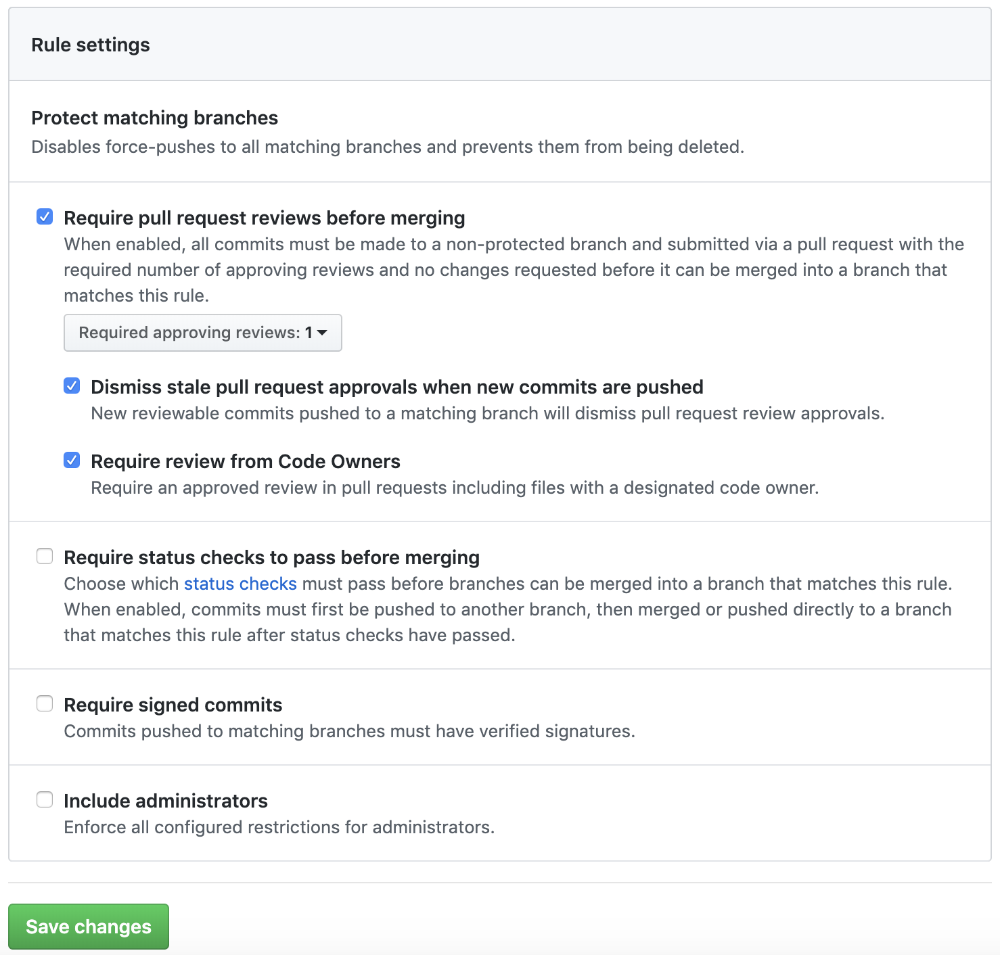
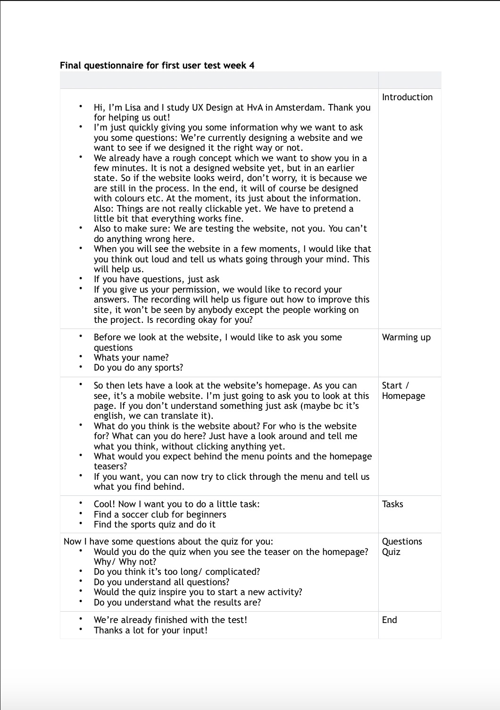

# meesterproef-personal

## Inleiding over het project

Tijdens de meesterproef ben ik in samenwerking Sterre, Bas en Jesse bezig om het sportaanbod in Amsterdam Zuid-Oost beter op de kaart te krijgen. Doordat er vele nationaliteiten binnen Zuid-Oost aanwezig zijn en er diverse doelgroepen zich daar bevinden, is het de uitdaging om deze groep zo goed mogelijk aan te spreken. Met zijn vieren maken we een gezamenlijk prototype waar de community informatie kan vinden en een quiz kan volgen om te kijken welke sport er het meest geschikt is voor die persoon. Ook de sport-aanbieder hebben hun eigen omgeving, waar ze evenementen kunnen aanmaken voor hun sportclub.

## De belanghebbende:

- De inwoners van Amsterdam Zuidoost: De doelgroep die aangesproken dient te worden. De doelgroep weet niet af van het grote sportaanbod en heeft vaak geen idee welke sporten er daadwerkelijk passen bij de specifieke voorkeuren.
- De sport aanbieder: Deze groep heeft moeite het bereiken van de doelgroep. De bewoners van Amsterdam Zuidoost weten niet af van de activiteiten die door de clubs gepland worden en hebben moeite met het aanbieden van de juiste data om contact te krijgen met de doelgroep.
- De sport makelaars: Deze groep heeft baat bij een georganiseerd platform waar data over clubs gemakkelijk te vinden is, zodat ze de bewoners van Amsterdam Zuidoost kunnen doorverwijzen naar de sport aanbieders.

## Leerdoelen

| Vakken                   | Leerdoel                                                                                                                                                                                   |
| ------------------------ | ------------------------------------------------------------------------------------------------------------------------------------------------------------------------------------------ |
| **Web App From Scratch** | _De code bevat geen syntax fouten en is netjes opgemaakt._                                                                                                                                 | Vul nog in |
|                          | _Er is minimaal gebruik gemaakt van een IIFE en Object Literals om structuur, in de vorm van modules, aan te brengen aan de code en onnodige vervuiling van de globale scope te voorkomen_ | Vul nog in |
| **Web Design**           | _Er zijn verschillende tests gedaan en verwerkt om het ontwerp te verbeteren._                                                                                                             | Vul nog in |
| **Real Time Web**        | _De server houdt een datamodel bij en elke client wordt de juiste data doorgestuurd_                                                                                                       | Vul nog in |

## Week 1

27 mei -31 juni

De week begon met een meeting op het Bijlmer Sportpark. Bij deze meeting waren de studenten van de UX minor aanwezig. Deze studenten waren afkomstig uit Duitsland, Denemarken en Australië. Ook was hier Daan van der Werf aanwezig, een tussenpersoon die de HvA en de klant bij elkaar heeft gebracht. Daan is werkzaam voor Academie van de Stad als projectcoördinator. Uiteraard was ook de klant aanwezig, Harry Supheert neemt hier de leiding in en heeft veel connecties binnen Amsterdam Zuidoost. Door zijn connecties heeft hij ons direct een aantal testmomenten kunnen voorschotelen met echte gebruikers uit de doelgroep. Het UX team hield een presentatie met daarin de belangrijkste bevindingen voor het project. Hier zat onderzoek in over de doelgroep, waar rekening mee gehouden kon worden en het idee/concept waar de Ux studenten zich op wilde richten. Na een kort gesprek werden er wat wilde ideeën opgenoemd met vervolgens de vraag of dit mogelijk zou zijn om uit te voeren.

Omdat de UX studenten al eerder van start waren gegaan, was er in de komende weken een beoordelingsmoment van de wireframes die uitgewerkt zouden zijn. Harry en Daan wilde hier graag een beeld van hebben en besloten om een afspraak in te plannen om dit gezamenlijk door te kijken. Al snel kwamen we tot de conclusie dat er op 28 juni een staking zou plaatsvinden met het openbaar vervoer. Om die reden is Harry ons tegemoet gekomen door naar het HvA te komen.

Tijdens de presentatie op 28 juni hebben we het concept helder uitgelegd gekregen van de UX studenten. Hier was rekening gehouden met de bestaande problemen, en was er nagedacht over passende oplossingen op deze vraagstellingen. Hier kregen we een inzicht in de wireframes die nog verder uitgewerkt moesten worden. De beoordeling hiervan zou voor de UX studenten zijn op 1 Juni. Nadat deze presentatie gegeven was, hebben we nog kort nagepraat hoe we verder konden gaan met elkaar. Opties zoals 1 UX student en 1 WebDev student, of 4 UX en 4 WebDev kwamen ter sprake. Omdat het voor ons dubbel werk was om 4 keer dezelfde server op te gaan zetten, besloten we voor deze week om gezamenlijk aan de gang te gaan. Op die mannier kon UX zich focussen op de wireframes die ingeleverd moesten worden.

Die week hebben we zoals besproken een begin gemaakt aan de server, en schreven we ideeën uit van hoe we bepaalde methodes konden toevoegen. Joost Faber heeft ons die week aangesproken om te vertellen dat een inlog scherm geen prioriteit had voor de eerste week, en dat veel projecten in voorgaande jaren hier op gesneuveld waren. Om die reden hebben we besloten dit dan ook niet verder uit te werken.

## Week 2

3 - 8 juni

Na de eerste week achter de rug te hebben met Hemelvaartsdag daar bij, zijn we begonnen aan een begin van prototypes. Omdat we alleen de basis hadden gekregen van de UX studenten van de wireframes, hebben we deze zo ver mogelijk proberen te hanteren. Deze wireframes waren na de presentatie op dinsdag 28 juni niet meer aangepast. Ik had besloten om het onderdeel van de Quiz op te pakken. Ik was erg benieuwd hoe ik een resultaat moest gaan koppelen aan de uitkomsten van input Fields, dus ben ik begonnen met de basis neer te zetten van de functionaliteit. De basis van de quiz bestond uit: range input, radio buttons en check boxes. Deze waardes heb ik vervolgens weten uit te lezen met de Javascript die clientside gebruikt werd. Later op de dag hebben we een leeg lokaal gevonden om zo de uitgewerkte wireframes van het UX team in te kunnen zien en te bespreken. Hier hebben we ook na kunnen denken over de vraagstellingen voor de testrondes op dinsdag

Op dinsdag ben ik samen met Sterre, Christian en Lisa richting de Bijlmer gegaan waar we een afspraak hadden met Eline Sjerps op het Open Schoolgemeenschap Bijlmer (OSB). Op deze middelbare school kregen we de mogelijkheid om in 15 minuten 4 tests af te ronden. We kregen 2 lokalen beschikbaar waar we in tweetallen de test konden afnemen. Omdat ik al begonnen was aan het uitwerken van de Quiz, ben ik samen met Lisa de functionaliteit, de user flow maar vooral de vraagstelling gaan testen. De testpersonen waren beide 15 jaar oud en konden prima Engels spreken. Dit kwam voor ons goed uit aangezien de wireframes in het engels geschreven waren door de UX studenten. Uit deze testen bleek dat er op bepaalde onderdelen in de quiz er een ander scenario van interactie plaatsvond. Op plekken die waren aangeven om 1 keus in te maken, werden er meerdere geselecteerd. Dit gaf ons een goed inzicht over of de vraagstelling juist was, en of het inderdaad geen multiple choice vraag had kunnen zijn.

Nadat er getest was met de studenten op het OSB zijn we gaan verzamelen bij World of Food. Op deze locatie hebben we vervolgens als groep kunnen werken aan de resultaten uit de tests, en ben ik vervolgens verder gegaan met het uitwerken van de Quiz. Omdat er in het ontwerp van Lisa sprake was van “staging” van vragen, ben ik dit gaan proberen uit te werken met Javascript. Later die dag Hebben we nogmaals een meeting gehad op het Bijlmer Sportpark, waar de UX studenten de uitgewerkte wireframes aan Daan, wij als WebDev team en Vincent Pappot lieten zien. Vincent is een sport makelaar die er voor zorgt dat de doelgroep en de clubs met elkaar verbonden raken. Vincent is hierdoor ook direct een van onze eindgebruikers. Hier gaf Vincent aan dat hij veel vraag kreeg naar informatie over sportclubs, en dat hij dit vaak opnieuw moet opzoeken.

Verder die week hebben we de taken verdeeld om uit te werken. Ik kon verder gaan met het ontwikkelen van de Quiz. Doordat er bij het presenteren van de wireframes nieuwe schermen waren toegevoegd binnen de quiz, heb ik hier nieuwe opties voor moeten aanmaken. Aan het eind van de week was de interactie binnen de vraagstukken van de quiz volledig werkend. Over de berekening van de juiste uitkomst had ik nog mijn vragen. Ik heb met Lisa gesproken of ze zelf een idee had van hoe bepaalde resultaten konden worden omgezet naar resultaten. Hier had ze niet een concreet antwoord op.

Op donderdag heeft Sterre een opzet gemaakt van het Design. Doordat er koffie over haar laptop was gevallen, was ze genoodzaakt op een laptop door te werken waar niet alle programma’s op aanwezig waren. Door deze stijl kwam er een beter beeld van de context van het ontwerp.

Om de week af te sluiten hadden we een gesprek met onze coach Koop Reynders. Hier vertelde we hoe ons proces verlopen was en waar we heen wilde gaan de komende weken. Koop vertelde in dit gesprek dat hij meer samenwerking verwachtte tussen UX en WebDev om het concept wat aan te scherpen. We hadden moeite om hier Koop gelijk te geven, aangezien we hadden verwacht dat wij de uitvoerders waren van datgene wat UX zou bedenken en ontwikkelen. Hoe Koop het voor zich zag was namelijk dat wij als WebDev team de mogelijkheden hadden om op korte termijn iets in elkaar te rammen, dat we gezamenlijk zouden kunnen testen met UX. Op die mannier konden we het eindproduct veel beter dicht metselen. Het lastige hieraan was dat de UX studenten niet afhankelijk waren van wat wij gingen uitvoeren. Op het moment dat de UX studenten de wireframes hadden uitgewerkt, ging ieder verder aan zijn onderdelen van het eindproduct. Er is vanaf de UX kant geen samenwerking aan 1 gezamenlijk product. Toch had Koop wel degelijk een punt en om die reden heb ik in week 3 een afspraak ingepland.

## Week 3

10 - 14 juni

Na het weekend waar ik heb nagedacht over hoe ik de quiz werkend zou kunnen krijgen en met de feedback die we ontvingen van Koop wilde ik me van mijn goede kant laten zien. Doordat we vanuit de gemeente Amsterdam geen aangeleverde data hadden, was het voor ons niet anders dan deze data zelf te gaan creëren. Ik had een A4tje opgesteld met de vragen uit de Quiz. Mijn bedoeling was om naar willekeurige mensen te lopen, te vragen of hij of zij aan een sport deed, om vervolgens de gegevens van deze sport toe te gaan passen op de sportvragen op het papiertje. Samen met Jesse ben ik de UX designers gaan opzoeken, om hier de vorderingen te bespreken van de quiz, en mijn idee van quiz resultaten genereren te bespreken. Doordat er nog meer mensen aan de tafel van de UX studenten zaten, was het voor mij vrij eenvoudig om hen deze vragen ook te stellen. Een van de inzichten hieruit was dat er in de categorie motivatie enkele keuzeopties ontbraken. Lisa stemde in met het idee om de Quiz resultaten op deze mannier te gaan genereren.

Op dinsdag had ik de resultaten van de Quiz werkend. Samen met Sterre ben ik vervolgens bij Lisa langs gegaan om de werking ervan uit te leggen. Na te laten zien, hebben we de werking van de Quiz nog 1 maal getest op een student van CMD, genaamd Jayjay Slikker. We kwamen erachter dat de benaming in de quiz alsnog een slag moesten maken. Aan het eind van de test realiseerde Lisa zich dat ze in het begin van het project een excel lijst had gemaakt die overeen kwam met hoe ik de quiz resultaten koppelde aan de sporten. Deze heeft ze vervolgens doorgestuurd zodat ik deze kon omzetten naar bruikbare data. Dit was erg handig want nu hadden we de beschikking over ruim 40 sporten in de quiz met echte resultaten.

Die week stond ook mijn persoonlijke gesprek met Joost Faber op de planning. In dit gesprek bespraken we mijn leerdoelen en waar ik me meer op kon focussen die week. De voorbereiding aan dit gesprek was vanuit mijn kant niet erg uitgewerkt, waardoor ik geen concrete leerdoelen had opgesteld. Joost adviseerde mij om dit alsnog te gaan doen. Hij heeft me vervolgens de opdracht gegeven om te leren “refactoren”. Dit houdt in dat op het moment dat je code werkt, dit vervolgens op een nettere manier op te schrijven. Met deze methode zorg je ervoor dat de code die je geschreven hebt compacter wordt en beter leesbaar voor andere die jouw code bekijken. Ook gaf hij de tip om met de groep te gaan bekijken wat er allemaal nog uitgevoerd moet, kan, willen en zouden willen uitvoeren. Deze methode wordt ook wel de MoSCoW methode genoemd.

Deze MoSCoW hebben we diezelfde dag nog samengesteld. Dat gaf ons een goed inzicht van wat er allemaal nog moest gebeuren binnen het project. Je kijkt als het ware met een helicopter view uit op het project, en kan zodoende makkelijker keuzes maken. Ondanks we de resultaten enigszins in hoofd hadden zitten, was het toch fijn om dit met het gehele project op 1 lijn te hebben. Het voordeel hiervan was dat we exact wisten wie wat ging doen en wie waar mee bezig was op het moment. Zo konden we ook knopen door hakken met betrekking to haalbaarheid binnen de tijd die we ter beschikking hadden.

In het gesprek met Joost werd het duidelijk dat mijn Quiz opnieuw gebouwd zou moeten worden. Dit omdat de functionaliteit niet zou werken op het moment dat javascript uit zou staan. Ik vond het erg lastig om dit om te zetten naar Server side logica. Dit omdat ik weinig ervaring had met het werken van Modules. Ik snapte niet hoe ik bepaalde waardes kon meegeven aan een Module die dan gebruikt kon worden op de pagina waar alles samen kwam. Jesse heeft mij hier mee proberen te helpen, maar heeft me vooral laten zien hoe hij iets zou aanpakken. Wanneer Jesse iets uitlegt vind ik het lastig om direct te snappen hoe het eigenlijk werkt, omdat ik niet op dezelfde manier nadenk als hij. Ik vind het lastig om soms simpel te denken, en hou dan minder rekening met andere oplossingen. Die week heb ik veel met Jesse meegekeken hoe hij bepaalde codes opbouwt. Dit hielp me erg veel met het leren nadenken over opbouw en lean en mean schrijven.

Later die week heb ik de groep bij elkaar geroepen in een leeg lokaal. Ik wilde namelijk met elkaar de gehele code doorlopen om deze te bespreken. Doordat we allemaal een andere stijl hebben van coderen, zit er niet echt een eenheid in. Op een beamer hadden we een scherm open, en gingen we door alle files kijken waar er aanpassingen doorgevoerd konden worden. We kwamen hier tot de conclusie dat de benaming erg uiteen liepen, dat de folder structuur verbeterd kon worden en dat we met helper functies de code wat netter konden hergebruiken. Ik ben van mening dat dit een van de belangrijkste momenten was uit het project. Het was enorm leerzaam om gezamenlijk de code te bespreken, je deelt je eigen inzichten en leert ook van de inzichten van je teamgenoten. Dit was voor ons allen de eerste keer dat we qua code in teamverband moesten werken. De afspraken werden onderling verdeeld en de dag erna zouden we met elkaar de gehele code herstructureren.

Aan het eind van de week hadden we opnieuw een gesprek met Koop. Hier bespraken we hoe het de afgelopen week verlopen was. Hierin werd duidelijk dat de UX studenten duidelijk voor hun eigen beoordeling aan het werk waren, en wat minder in dienst van het gezamenlijke eindproduct. Ondanks dat Lisa mij persoonlijk veel betrok bij de ontwikkeling van de quiz, had ik ook het gevoel dat het samenwerken met de overige UX studenten wat stroperig verliep. Wij maakte gebruik van het onderzoek en de inzichten van het UX team, aan deze potentie werd niet wederzijds gezien. Koop stelde ons vervolgens voor om wat af te gaan wijken van het concept/idee wat het UX had ontwikkeld. De Call To Action van de quiz of sportlijst zou veel aantrekkelijker worden wanneer we evenementen zouden koppelen aan de sporten. Op die mannier zou de drempel verlaagd worden als een gebruiker direct zou kunnen zien waar hij of zij zou kunnen deelnemen of een kijke zou kunnen nemen. Hier waren wij het mee eens en hebben dit advies ook doorgevoerd.

## Week 4

17 - 21 juni

Aan het begin van week 4 hebben we de structuur van onze data goed onder handen genomen. Doordat ik bezig was met het uitwerken van de Quiz met beschrijvingen per sport, en Bas deze data ook nodig had, kwamen we tot de conclusie dat het heel onlogisch is om data van de quiz in te laden om vervolgens beschrijvingsdata van een sport op te kunnen halen. Vervolgens hebben we het team bij elkaar geroepen bij een whiteboard, en ons probleem uitgelegd. Hier hebben we gezamenlijk nagedacht over de beste aanpak van de structuur van de data. Hier kwamen we tot 2 oplossingen, waar de optie die we gekozen hadden de optie was die het gemakkelijkst door te voeren was, maar alsnog elegant. De andere optie zou misschien de duidelijkste optie zijn, aangezien daar alle data in 1 object zou staan die geclusterd zou worden. Het enige nadeel hiervan is dat de opgevraagde data hiervan stukken groter zou worden.

Nadat we de datastructuur besproken hadden, zijn we de structuur van de mappen gaan herindelen zoals besproken tijdens de refactor Class. Doordat ik nog weinig met Modules had gewerkt, was ik het overzicht enigszins verloren waar ik bepaalde elementen kon terugvinden. We hebben vervolgens alle bestanden opnieuw geclusterd en de benaming van de bestanden zo ingedeeld dat je aan het bestand al af kon lezen uit welke map dit kwam. Het voordeel hiervan was dat de structuur ook voor de partij die later ons prototype gaat ontwikkelen duidelijk zou zijn. Iedereen kreeg een deel toegewezen die hij of zij zou aanpakken. Het probleem wat hier bij kwam kijken was dat de bestanden die gekoppeld waren aan elkaar, niet direct mee wisselde van naam. Dit resulteerde in veel errors doe vervolgens handmatig aangepast diende te worden.

Op dinsdag 18 juni hebben we weer een bespreking met de klant gehad. De UX studenten waren hier ook aanwezig, evenals Vincent en Daan. Tijdens deze meeting bespraken we onze voortgang en gaven we een demonstratie van ons prototype. Het prototype dat we ontwikkeld hadden kreeg positieve reacties. Vincent was vrij kritisch op datgene wat we ontwikkeld hadden. Wij denken dat het bij Vincent niet helemaal helder was dat we werkte aan een prototype, in plaats van een volledig uitgewerkt product. Op het moment dat de UX studenten de interactieve wireframes lieten zien op de beamer, werd het voor ons duidelijk dat er een misverstand was in datgene wat wij presenteerde en het werk waar UX aan werkt. Vincent was onder de indruk van alle micro interacties, waardoor ons prototype werd overschaduwd door de mooie transitie van afbeeldingen van UX. Na afloop hebben we besproken dat we het grote verschil nog kunnen laten zien in de aankomende week.

Later die week had ik mijn tweede gesprek met Joost Faber. In het gesprek bespraken we de voorgang van ons team, maar ook vooral mijn persoonlijke voortgang. Doordat ik me netjes had gehouden aan de aanbevelingen die Joost me gegeven had, was hier weinig op aan te merken. Wel was er aan de functionaliteit van de quiz het een en ander wat verbeterd kon worden voor de usability. Doordat Jesse de complexe gedeeltes uit ons prototype had ontwikkeld, kon ik dit op Jesse afdragen. Wel kwamen we tot de conclusie dat de styling van de site en voornamelijk de quiz nog context miste. Het ontwerp zag er in zijn ogen wat rommelig uit en hier kon ik me volledig bij aansluiten. Echter hadden we de styling in de planning voor Week 5, dus hier voelde ik me wat minder op aangesproken. Ik heb gemerkt tijdens het ontwikkelen van een prototype dat ik de styling minder belangrijk vind om me op te focussen. Dit omdat ik van mezelf weet dat het qua styling uiteindelijk wel goed zal komen. In het teamverband is Sterre degene die de huisstijl bewaakt. Op het moment dat er keuzes gemaakt worden, hakt Sterre de knopen door. Later in Week 5 werken we samen aan de styling verder.

## Week 5

De laatste week brak aan en er waren veel onafgemaakte taken. Als eerst ben ik begonnen met helpen van Sterre met haar A tot Z lijst. In de data die we binnen haalde van een externe bron zaten veel foutjes. Deze foutjes waren door de sportclubs zelf incorrect ingevuld, waardoor de data in onze app ook de fouten bevatte. Door met RegEx te werken ben ik erin geslaagd om alle spaties van de sportnaam aan het begin of het eind van het woord weg weten te halen. Op het moment dat er vreemde karakters binnen de naam van een club stonden, werden deze er nauwkeurig uitgefilterd. Het voordeel van deze schoonmaak was dat de data nog steeds dynamisch bleef, en we geen dubbele data in de dataset kregen. Dit proces valt eigenlijk onder het mom van refactoren.

Later die maandag bespraken we met Koop onze laatste ontwikkelingen. Hij vroeg ons naar het verloop van de afgelopen meeting. Hierin vertelde we dat we enigszins verrast waren van de reactie op de UX sturende door de fancy animaties. We voelde ons overschaduwd en kregen het idee dat de functionaliteit van ons prototype er minder toe deed. Koop wist ons echter zo aan te spreken dat we overtuigd waren van het resultaat wat wij bereikt hadden. Door de ervaring die Koop heeft opgedaan in het werkveld, kon hij een schatting maken van de situatie. Hij vertelde ons dat wanneer wij op woensdag ons prototype gingen presenteren, dat we de problemen moeten benoemen en dat we exact datgene hadden gemaakt waar de klant naar opzoek was. Hier kwamen meerder scenario’s ter sprake ik vond dit een van de beste gesprekken die ik deze minor heb gehoord. De mannier van onderbouwen en verkopen die we hier te horen kregen motiveerde mij enorm! Na het gesprek besloten we de laatste puntjes op de i te zetten.

Op dinsdag hebben we de laatste styling punten uitgewerkt. Samen met Sterre heb ik gekeken naar hoe we de quiz zodanig kunnen stijlen dat deze duidelijk, maar ook aantrekkelijk blijft. Sterre heeft een goede blik op ontwerp, en mijn kracht ligt meer bij hoe iets leesbaar is. Daar waar Sterre niet wist hoe ze iets in haar hoofd visueel kon maken, kon ik de juiste waardes en functies benoemen. Samen hebben we de quiz kunnen stijlen en hebben we met BEM classes gewerkt. Het bleek echter lastig te zijn om de resultaten pagina te stylen. Jesse had een carrousel ontwikkeld die kaarten kon laten ronddraaien zodra deze gesleept werden. Doordat hier veel gebruik was gemaakt van position absolute en styling die direct op het element werden geplaatst voor de functionaliteit, was het nog lastig om bepaalde elementen aan te passen. Echter is dit wel netjes gelukt naar eigen zeggen.

Op woensdag stond de afspraak om 1 uur bij het Bijlmer Sportpark. Harry, Vincent en Daan waren aanwezig om het eindproduct te bezichtigen. We vertelde nogmaals wat de inzichten waren die de UX had onderzocht, en op basis daarvan hoe wij de problemen hadden opgelost. Nadat ieder zijn woordje had gedaan, was Harry erg enthousiast over het eindresultaat. Met nog een paar kleine opmerkingen kon hij ons vertellen dat het werk wat we geleverd hadden in de smaak viel. Ook Daan had veel lovende woorden over hoe het eindproduct uit de verf was gekomen. Na verloop van het gesprek was er bij Vincent de vraag wat ons prototype nou verschilde met het eindwerk van UX achter de schermen. Hieruit konden we concluderen dat we vorige week juist geconstateerd hadden dat het verschil tussen een afbeelding prototype en een werkend product niet duidelijk was. Na kort uitgelegd te hebben dat we hier een tastbaar product hadden die functioneert zoals verwacht, begon het kwartje te vallen. Harry heeft ons vervolgens om adviezen gevraagd over het verloop van de uitwerking, en ons om een schatting gevraagd wat de volledige uitwerking ongeveer zal kosten. We ontvingen een applaus voor ons resultaat en de inzet die we hier in gestoken hadden.

## Reflectie

## Web App From Scratch

> De code bevat geen syntax fouten en is netjes opgemaakt.

> Er is minimaal gebruik gemaakt van een IIFE en Object Literals om structuur, in de vorm van modules, aan te brengen aan de code en onnodige vervuiling van de globale scope te voorkomen

Op het gebied van Web App From Scratch viel er voor mij nog veel te leren.Tijdens de lessen van het vak ben ik nauwelijks toegekomen aan het gebruik van modules. Ik had het toegepast, maar snapte het voordeel hier niet van. Door samen te werken als groep kwamen we er al snel achter dat we veel merge conflicts kregen zodra we zouden werken in 1 file. Het opdelen van de code was vervolgens een logische stap om merge conflict te voorkomen. Het voordeel hiervan is dat elk stukje code in een los bestandje staat, wat er voor zorgt dat je tegelijk aan 1 pagina zou kunnen werken zonder direct in de zelfde bestanden te zitten werken.

Echter hadden we in het begin van het project nogal moeite met het toepassen van de juiste conventies. Hier waren vooraf geen afspraken over gemaakt, maar beter laat dan nooit. Het viel ons namelijk op dat de mappen structuur niet logisch was en dat files door elkaar heen stonden. Met name tijdens onze refactor class kwam dit naar boven. Door vervolgens een conventie af te spreken en deze gezamenlijk uit te schrijven op het bord, was de verwarring bij iedereen verdwenen. Vanaf dit punt binnen het project ben ik pas echt gaan begrijpen hoe nuttig de Modules eigenlijk kunnen zijn. Over de benaming van deze Modules hebben we ook gediscussieerd. Het resultaat waar we op uit kwamen was dat we alle grote onderdelen een naam gaven, bijvoorbeeld “quiz”. Op het moment dat er modules in deze directory geplaatst moesten worden, gaven we deze de naam van de directory, plus een beschrijvende naam van het conponent. Een Module van de carrousel van de quiz zou als volgt zijn “ js/modules/quiz/quiz-carrousel ”. Dit hielp mij persoonlijk erg goed de juiste files te vinden. Als ik vervolgens iemand uit ons project wilde helpen, kon ik zo ook gemakkelijk de juiste bestanden vinden. Deze mappenstructuur hebben we aangehouden voor de server modules, de client side javascript en de css.

Halverwege het project kwamen we er achter dat het mergen naar GitHub voor problemen kon zorgen. Het gebeurde namelijk dat iemand per ongeluk onze development branch had gedeletet van GitHub. Ook kon het voorkomen dat invalide code alsnog werd gemengde of werd overschreven met dat van een ander. Dit gaf ons de reden om Branch Protection Rules op te stellen. Al vroeg in het project hadden we besloten om in branches te werken. Op de master branch pushen we het project zodra deze volledig werkt. In de development branch worden alle losse branches gepushed. Het is de bedoeling dat er vanaf de development branch een nieuwe branch werd aangemaakt. In deze branch werkte je de features uit waar je mee bezig was. Zodra deze features werkend gekregen waren, werden deze naar GitHub gepushed. Vervolgens moest ieder een pull request aanmaken om zo de nieuwe branch met de development branch te mergen. In deze pull request moest je een collaborator vragen om de code te reviewen. Wanneer ik gevraagd werd om code te reviewen, kreeg ik een goed inzicht of de code niet vervuild werd. Ook had ik hier een goed beeld op eventuele merge conflicts. Ik als administrator van het project zou in theorie niemand nodig hebben om het werk te moeten mergen. Echter heb ik hier geen gebruik van gemaakt, om zo de kans op fouten te verkleinen. Het lastige aan werken met branches is dat de code waarin je werkt verouderd kan raken met datgene wat op GitHub staat. Hierdoor werd ik genoodzaakt om met een hogere regelmaat mijn werk naar GitHub te pushen. Ondanks dit best goed ging, ben ik van mening dat ik hier nog wat stappen in kan maken. Dit gehele proces droeg bij aan het valide houden van de code.

Als laatst hebben we binnen het project onze Prettier instellingen afgesteld op elkaar. Op deze mannier was de codestructuur bij de teamgenoten gelijk, en werd het meer een eenheid. Door dit te doen werd de code van een ander inzichtelijker, aangezien deze op de zelfde manier was ingedeeld als in je eigen code editor. Het gebruik van een dubbel quote werd gehanteerd in plaats van een enkele quote. Ook kozen we ervoor om gebruik te maken van een semicolom in plaats van dit weg te laten. Ondanks het verschil niet veel zou uitmaken, leerde je werken met conventies en had iedereen dezelfde conventies gebruikt.

## Web Design

> Er zijn verschillende tests gedaan en verwerkt om het ontwerp te verbeteren.

Het testen met de UX studenten heeft veel betekend voor het eindproduct. In de afgelopen jaren is meerdere malen getest met behulp van een testplan. Dit testplan was vaak niet uitgebreid, en de scenario’s waren vaak zo geschetst dat er niet direct een nuttig resultaat uit kwam. Ditmaal hadden Lisa van de UX minor het testplan uitgewerkt. Tijdens het testen op de OSB werd duidelijk hoe nuttig een testplan was. Doordat Lisa al langer bezig was met de quiz, wist ze eigenlijk uit haar hoofd hoe deze test zou moeten verlopen. Echter was de verwachting dat de studenten moeite zouden hebben met de Engelse taal om haar te begrijpen. Om die reden heb ik het testplan goed doorgenomen om zo de juiste vragen te kunnen stellen aan het test persoon. Ik begon het nut in te zien van een test plan, en ben ook van mening dat de structuur die Lisa bracht met het testplan, dat deze een groot voordeel heeft gebracht in het verloop van de Quiz.

Nadat ik de resultaten van de Quiz heb kunnen uitwerken, ben ik wederom met Lisa gaan zitten om het gedeelte te testen van de Quiz waar de resultaten te zien waren. Het fijne hieraan was dat ik de feedback van een testpersoon ter plekke kon aanpassen, om zo een iteratie te maken waar nodig. Dit voordeel was er ook toen ik de formule voor quiz resultaten ging testen. Door de vragen uit te printen was het voor mij enorm inzichtelijk waar ik rekening mee moest houden bij het uitwerken van de resultaten van de quiz. Ik ben van mening dat dit proces de quiz ten goede is gekomen, en voor mij persoonlijk een inzicht was dat het testen met korte iteraties daadwerkelijk nuttig kon zijn.

## Real Time Web

> De server houdt een datamodel bij en elke client wordt de juiste data doorgestuurd

In de afgelopen weken voordat de Meesterproef begonnen was, was de management van data niet echt aan bod gekomen. Omdat ik als eerste met data aan de gang was gegaan om de resultaten van de quiz te genereren, liepen we hier in een later stadium van het project tegenaan. Wanneer de Quiz uit kwam op bijvoorbeeld Hockey, moesten hier de juiste beschrijving van de sport bij geplaatst worden. Deze beschrijving van de sport was in een JSON bestand te vinden genaamd quizResults.json. Later in het proces werd duidelijk dat zodra Bas deze data ook wilde gebruiken, dat het onlogisch zou zijn om de quiz data in te laden voor alleen deze beschrijving te gebruiken. Niet alleen qua performance was dit geen goed idee, maar ook met de kijk op logica was het vreemd om de beschrijving van een sport terug te vinden onder de naam quizResults.JSON

Na deze bevinding hebben we de structuur van onze data op een whiteboard uitgeschreven. Hier konden we rekening houden met de performance, dus wanneer de juiste data werd opgehaald als dit nodig was. Ook hebben we hier gesproken over hoe de data gebruikt zou moeten worden, en wat de ideale structuur zou zijn om deze data bij te houden. Dit was iets waar ik zelf niet eerder aan gewerkt had, maar kon me al snel voorstellen hoe nuttig dit kon zijn. In dit project hebben we geen aangeleverde data ontvangen van de klant, waardoor we voornamelijk onze eigen data hebben moeten zoeken of genereren. Door na te denken over hoe de structuur er uit zou moeten zien, werd het voor ons duidelijk hoe we bepaalde dubbel gebruikte data konden verminderen. Ik heb heel veel geleerd van de mannier hoe Jesse dit helder kon uitleggen op het bord. Het opdelen van de data net zoals we de infrastructuur hadden gedaan, heeft veel goeds betekend voor ons prototype. We kregen inzicht van waar bepaalde data onnodig werd ingeladen, en hebben zo de performance ook kunnen verbeteren.

### Met dank aan

- [Bas Pieren](https://github.com/BasPieren)
- [Sterre van Geest](https://github.com/sterrevangeest)
- [Jesse Dijkman](https://github.com/jesseDijkman1)
